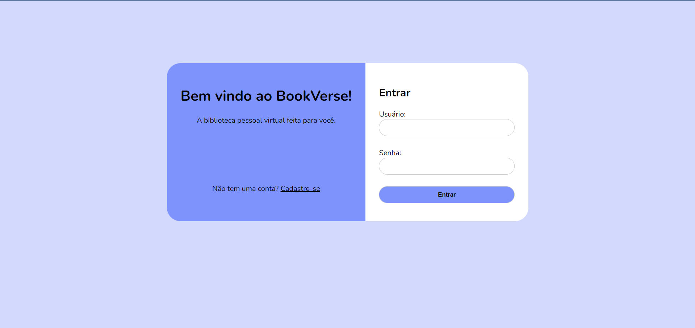
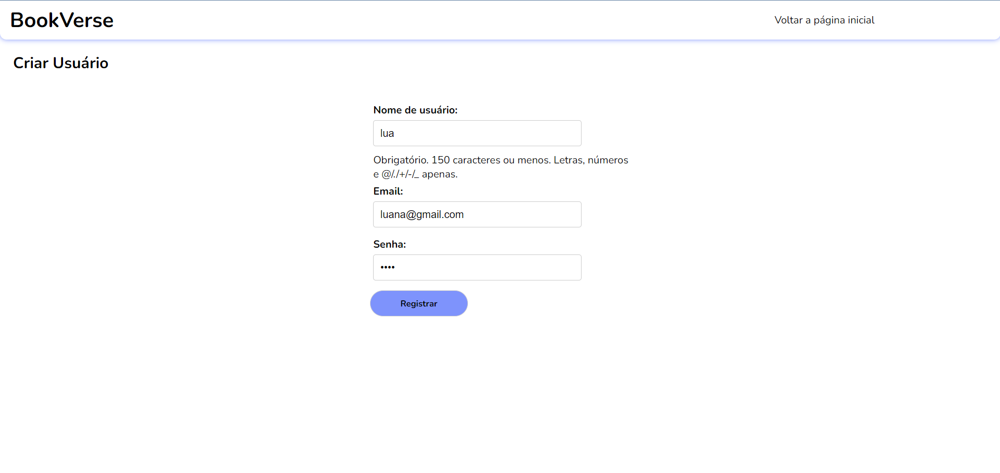
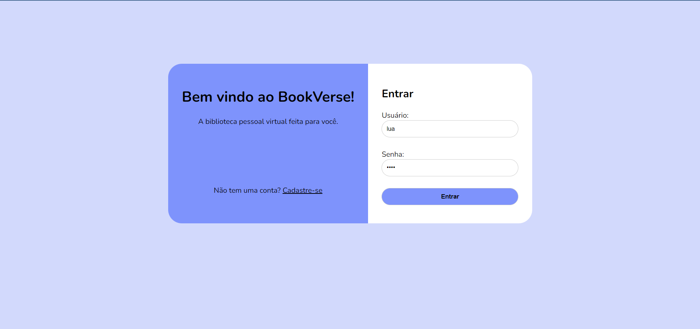

# BookVerse

BookVerse é uma API desenvolvida em Python usando Django Rest Framework no padrão Model View Template. É uma biblioteca pessoal onde você pode gerenciar seus livros, adicionar reviews e manter uma lista de desejos.

## Funcionalidades

- **Login e Registro de Usuário**: Crie uma conta e faça login para acessar a aplicação.
- **Gerenciamento de Livros**: Registre os livros que você possui com nome, autor, descrição e status de leitura.
- **Detalhes do Livro**: Adicione o status da leitura, edite informações do livro, exclua-o ou adicione reviews.
- **Lista de Desejos**: Adicione livros que você deseja com nome, autor e prioridade. Edite ou exclua livros da lista de desejos.

## Tecnologias Usadas

- **Python**
- **Django**
- **Django Rest Framework**

## Instalação

1. Clone o repositório:
    ```bash
    git clone https://github.com/LuanaSeres/API_BookVerse.git
    cd BookVerse
    ```

2. Crie e ative o ambiente virtual:
    ```bash
    python -m venv .env
    .env\Scripts\activate
    ```

3. Instale as dependências:
    ```bash
    pip install -r requirements.txt
    ```

4. Execute as migrações do banco de dados:
    ```bash
    python manage.py migrate
    ```

5. Execute as traduções da API:
    ```bash
    python manage_translations.py
    ```

6. Inicie o servidor:
    ```bash
    python manage.py runserver
    ```

## Uso

Na tela Inicial clique em Cadastrar-se


Crie seu usuário


Faça seu login



Após iniciar o servidor, acesse `http://127.0.0.1:8000/` em seu navegador para interagir com a aplicação.

1. No seu primeiro acesso, cadastre-se para poder efetuar o login.

2. Após criar seu acesso, faça login no BookVerse.

3. Na página inicial, você poderá adicionar um livro clicando em "Adicionar Livro" na parte superior direita do site. Esse link te levará para uma outra página onde você preencherá as informações do livro.

4. Após preencher e enviar as informações do livro, você será redirecionado para a página inicial, onde aparecerá o livro que você adicionou.

5. Clicando em "Detalhes", você entrará na página que contém as informações do livro. Nela, você poderá editar essas informações, deletar o livro, atualizar o status de leitura e adicionar reviews sobre o livro.

6. O processo de adicionar uma review é semelhante ao de adicionar um livro.

7. Também temos a página da Lista de Desejos, onde você pode adicionar os livros que deseja e definir uma prioridade de 1 a 10.

## Exemplos de Uso

